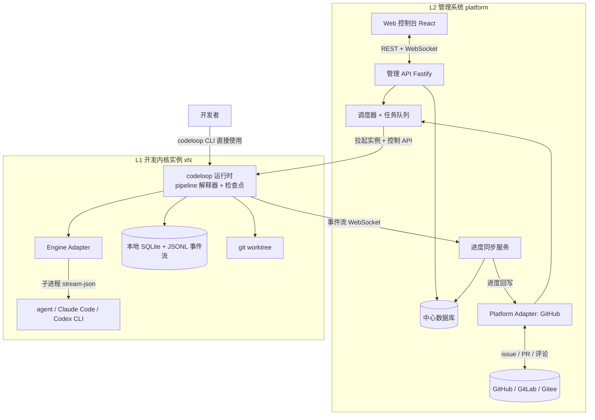
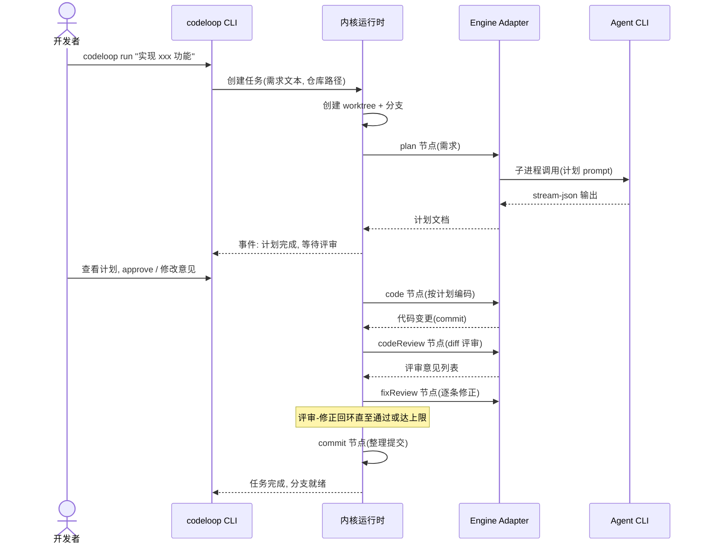
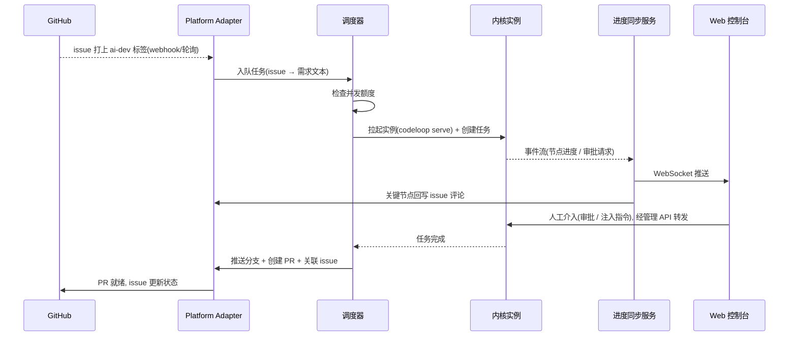

# AI 自动化开发工具 — 总体架构设计

> 版本：v0.1（初稿）
> 相关文档：[kernel-design.md](./kernel-design.md)（第一层：开发内核）、[platform-design.md](./platform-design.md)（第二层：管理系统）

## 1. 目标与定位

构建一个"自动化 AI 开发工具"，让 AI 承担从需求到提交的完整开发流程，同时保证人可以随时观察进度、随时介入。整体分为两层：

| 层 | 名称 | 定位 | 使用者 |
|---|---|---|---|
| L1 | 开发内核（codeloop） | 单任务的自动化开发引擎：需求 → 计划 → 计划评审 → 编码 → 代码检视 → 意见修正 → 提交，形成闭环 | 开发者直接通过 CLI / 本地面板使用；管理系统以程序方式驱动 |
| L2 | 管理系统（platform） | 多内核实例的编排与管理：对接类 GitHub 平台，拉取 issue 派发给内核开发，聚合并回写进度 | 团队通过 Web 控制台使用 |

两层严格解耦：**内核不知道管理系统的存在**，它只对外暴露控制 API 与事件流；管理系统是内核的一个"高级调用方"。这保证了：

- 个人开发者可以只安装内核 CLI 单独使用，零依赖管理系统；
- 管理系统可以替换、可以水平扩展，不影响内核的行为语义；
- 测试时可以直接对内核做端到端验证。

## 2. 核心技术决策

### 2.1 TypeScript 全栈

- **内核**：Node.js 库（`@devtools/kernel`）+ CLI（`codeloop` 命令）。库和 CLI 分离，CLI 只是库的一个前端，管理系统直接依赖库或通过内核守护进程的 HTTP API 驱动。
- **管理系统**：Node.js 服务（Fastify）+ React 前端（Vite），monorepo（pnpm workspaces）组织。

### 2.2 AI 能力：封装现有 Agent CLI，不自研 Agent

内核自身**不直接调用 LLM API**，编码/评审等智能环节全部通过 **Engine Adapter** 委托给现有的编码 Agent CLI：

- Cursor CLI（`agent -p --output-format stream-json`）
- Claude Code（`claude -p --output-format stream-json`）
- Codex CLI（`codex exec`）
- OpenCode CLI（`opencode run --format json`）

理由：

1. 工具调用、文件编辑、上下文管理、沙箱等 Agent 基础能力由成熟产品提供，内核专注于**流程编排**这一差异化价值；
2. 各家 CLI 都提供了 headless / 非交互模式和结构化流式输出，适合被子进程封装；
3. 引擎可插拔，不同节点甚至可以用不同引擎（如编码用 A、评审用 B，避免"自己审自己"的偏差）。

Engine Adapter 的统一接口、子进程管理与流式输出解析见 [kernel-design.md 第 4 节](./kernel-design.md#4-engine-adapter)。

### 2.3 流程模型：显式编排的 pipeline 而非自由 Agent

codeloop 不是"给 Agent 一个大 prompt 让它自己跑完所有环节"，而是一个**显式编排的 pipeline**：流程由少数节点原语（agent / review / gate / command / commit）按结构化块（顺序、循环、分支）组合而成，默认 codeloop 只是内置的一个模板，可按仓库/任务替换为自定义编排。这样：

- 每个节点边界天然成为**检查点**：可暂停、可审批、可重试、可人工接管；
- 进度对人可见、可解释（当前在哪个节点、第几轮迭代、产出了什么）；循环块必须声明上限与退出条件，终止性由构造保证；
- 评审环节可以独立配置为 AI 评审、人工评审或"AI 先审 + 人终审"（review 节点后接 gate 节点）。

### 2.4 工作区与产出物：一切基于 git

- 每个任务在独立的 git worktree + 分支上运行，互不干扰，天然支持多实例并发跑同一个仓库；
- 每个节点的代码产出以 commit 固化，人工介入时看到的永远是干净的 git 状态；
- 最终产出是分支上的一串 commit，由内核（或上层管理系统）推送并创建 PR。

## 3. 总体架构



### 3.1 两层职责边界

| 关注点 | 内核（L1） | 管理系统（L2） |
|---|---|---|
| 需求输入 | 一段文本需求（来自人或上层） | 从平台 issue 转换为需求文本 |
| 流程 | 单任务 codeloop pipeline（可编排） | 多任务排队、并发控制、失败重试 |
| git | worktree/分支内的 commit | clone 仓库、推送分支、创建 PR |
| 人工介入 | 检查点暂停、审批门、指令注入 | 把介入入口透出到 Web 控制台，转发给对应实例 |
| 配置 | 每仓库一份 `.codeloop/config.yaml` | 每 server 一份 `platform.config.yaml` |
| 状态存储 | 仓库旁 `.codeloop/`（SQLite + JSONL + 产物） | 中心 DB（接入清单 / 队列 / 实例 / 聚合事件） |
| 可观测 | CLI 实时渲染 + HTTP/WS 事件流 | 控制台看板 + 平台 issue/PR 评论 |

### 3.2 内核对外协议（两层之间的契约）

内核以守护模式（`codeloop serve`）运行时暴露：

1. **控制 API（HTTP）**：创建/启动/暂停/恢复/中止任务，提交审批决定，注入人工指令；
2. **事件流（WebSocket / SSE）**：节点转换、循环轮次、引擎输出、diff 产生、审批请求等结构化事件，支持断线后按序号重放；
3. **状态查询（HTTP）**：任务快照（pipeline 定义、当前节点、循环轮次、产物列表、git 状态）。

协议的具体定义（事件类型、payload 结构）见 [kernel-design.md 第 6 节](./kernel-design.md#6-事件协议)。管理系统是内核的调用方：派发与介入走上述接口；仓库配置、产物、事件历史则以该仓库 clone 上的 `.codeloop/` 为源，平台 DB **不存副本**。

### 3.3 配置与数据归属

**1 个 platform-server : N 个接入仓库。** Server 启动不绑定任何 git 仓库；仓库运行时登记。每个仓库最多复用一个 `codeloop serve --repo <clone>`。

| 跟谁走 | 落点 | 内容 |
|---|---|---|
| 跟平台 | `platform.config.yaml` | 监听、`dataDir` / `reposCache`、调度并发、GitHub/平台 token、`codeloopBin` |
| 跟平台 | `{dataDir}/platform.db` | 接入了哪些仓、任务队列、内核实例、聚合事件 |
| 跟仓库 | `{clone}/.codeloop/config.yaml` | pipeline、引擎 / 模型 / prompt、预算、git 前缀 |
| 跟仓库 | `{clone}/.codeloop/` | `kernel.db`、`events.jsonl`、worktree、任务产物 |

原则：平台问「管哪些仓、任务排到谁」；仓库问「这个仓怎么跑任务」。两套源各写各的，不收入同一张表。控制台改内核配置只是写回 clone 上的 yaml。`.codeloop/` 默认 gitignore，配置在本机 clone，不随远程仓库走。细节见 [platform-design.md 第 5 节](./platform-design.md#5-数据与配置)。

## 4. 核心数据流

### 4.1 人直接使用内核（L1 独立使用）



### 4.2 管理系统驱动（L2 编排）



## 5. 仓库结构（monorepo）

```
dev-tools/
├── docs/                          # 本设计文档
├── packages/
│   ├── kernel/                    # @devtools/kernel  内核库
│   │   └── src/
│   │       ├── loop/              # pipeline 解释器、节点原语(NodeRunner)实现
│   │       ├── engines/           # Engine Adapter 及各 CLI 实现
│   │       ├── store/             # SQLite + JSONL 持久化
│   │       ├── server/            # codeloop serve: 控制 API + 事件流
│   │       └── git/               # worktree / commit 操作
│   ├── cli/                       # codeloop 命令行(内核的人类前端)
│   ├── shared/                    # 两层共享的事件协议 / 类型定义
│   ├── platform-server/           # 管理系统后端(调度器/Adapter/同步)
│   └── platform-web/              # 管理系统前端(React)
└── pnpm-workspace.yaml
```

`packages/shared` 承载事件协议与控制 API 的 TypeScript 类型，是两层之间唯一的编译期耦合点。

## 6. 部署形态

按使用规模递进，三种形态使用同一套代码。对外分发为**单个** tarball `@devtools/codeloop`（GitHub Release 附件，暂不推 registry），装一次得到两个命令：

1. **单机个人模式**：`npm i -g ./devtools-codeloop-*.tgz` 后用 `codeloop`。`codeloop run` 直接在当前仓库工作，SQLite + JSONL 落在 `.codeloop/` 目录。无任何服务。
2. **单机团队模式**：同一安装包用 `codeloop-platform` 起管理系统（后端 + 内嵌前端）。内核实例作为**本地子进程**由调度器按仓库拉起（一仓一 `codeloop serve`，每任务一个 worktree）。平台配置与 `platform.db` 默认落在 `~/.codeloop-platform/`（或仓库内 `platform.config.yaml`）；各仓的内核配置与任务数据仍在各自 clone 的 `.codeloop/`。适合小团队 / 内网。
3. **容器化模式（扩展点，第一版不实现）**：调度器的实例启动器抽象为 `InstanceLauncher` 接口，第一版实现 `LocalProcessLauncher`，后续增加 `DockerLauncher` / `K8sLauncher`，把每个内核实例连同 Agent CLI 打进容器，实现资源隔离与横向扩展。

## 7. 安全与资源边界

- **Agent 执行边界**：Agent CLI 一律以受限模式运行（如 Claude Code 的权限模式、Codex 的 sandbox），写权限限定在任务 worktree 内；由 Engine Adapter 统一注入这些安全参数，节点实现无需关心。
- **凭证管理**：平台 token（GitHub PAT / App 凭证）只存在于 L2；内核实例通过一次性注入的、按仓库限权的凭证做 git 推送（或由 L2 代为推送，内核完全不接触凭证——第一版采用后者，更简单安全）。
- **资源控制**：每实例的引擎调用次数、token 预算、循环轮次上限、单节点超时都在 codeloop 配置与 pipeline 定义中声明，超限即挂起并请求人工介入，防止失控循环烧钱。
- **审计**：JSONL 事件流是 append-only 的完整审计日志，包含每次引擎调用的 prompt 摘要、产出 diff、审批人与决定。

## 8. 演进路线

| 阶段 | 范围 | 里程碑 |
|---|---|---|
| M1 | 内核最小闭环 | `codeloop run` 跑通 plan → code → commit（评审先用 AI 单轮）；内部已按节点原语实现，但只跑内置流程；单引擎（先接一个 CLI） |
| M2 | 完整 codeloop + 编排 + 人工介入 | ✓ 计划/代码评审回环、审批门、pause/resume、`codeloop serve` 事件流；预置模板（quick-fix / plan-only / review-only / m1-minimal） |
| M3 | 管理系统最小版 | ✓ 调度器 + GitHub PAT Adapter（拉 issue、开 PR、评论进度）+ 控制台任务看板/详情 |
| M4 | 强化 | 多引擎、失败恢复、容器化 Launcher、GitLab/Gitee Adapter |

---

下一层细节：

- 内核详细设计 → [kernel-design.md](./kernel-design.md)
- 管理系统详细设计 → [platform-design.md](./platform-design.md)
