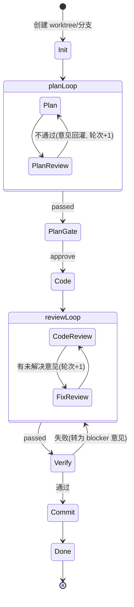

# 开发内核（codeloop）详细设计

> 上层文档：[architecture.md](./architecture.md)
> 内核是一个可独立使用的单任务自动化开发引擎：输入需求，按可编排的 pipeline 自动完成 计划 → 计划评审 → 编码 → 代码检视 → 意见修正 → 提交 的闭环，人可随时观察与介入。

## 1. 运行模型

### 1.1 核心概念

| 概念 | 说明 |
|---|---|
| Task | 一次完整的开发任务：一段需求文本 + 一个仓库 + 一个 pipeline 定义。任务在独立 worktree/分支上运行 |
| Pipeline | 可编排的流程定义：由节点按结构化块（顺序 / 循环 / 分支）组合而成；默认 codeloop 只是内置的一个 pipeline 模板 |
| Node | 流程中的一个环节，由少数几种**节点原语**之一实例化（如 `plan` 是一个 `agent` 原语节点） |
| Loop 块 | 结构化循环：声明 body 节点序列、`until` 退出条件与 `maxIterations`；计划回环、评审回环都由它表达 |
| Checkpoint | 节点边界的持久化快照，暂停/恢复/崩溃恢复的锚点 |
| Gate | 审批门节点：要求人给出 approve / reject / edit 决定后流程才能继续 |
| Artifact | 节点产物：计划文档、评审意见列表、diff、commit 等，以命名产物（artifact key）在节点间传递，全部落盘可追溯 |

### 1.2 编排模型：结构化 pipeline，而非自由 DAG

codeloop 的流程是**可编排**的，但刻意不开放"任意节点连边"的自由图，只提供三种结构化块：

- **sequence**：顺序执行；
- **loop**：循环块，必须声明 `maxIterations` 与 `until` 退出条件；
- **branch**：条件分支（`when` 表达式选择子流程）。

选择结构化而非自由 DAG 的理由：

1. **终止性由构造保证**：每个循环必须有上限，写不出无限回环；超限统一挂起等人处置；
2. **进度可解释**：UI 能按块渲染出确定的进度条和"当前位置"，检查点语义简单（节点 id + 各层 loop 计数器）；
3. **配置可读**：顺序 + 循环的 YAML 一眼能看懂；自由边列表 + guard 表达式在流程稍复杂时不可维护。

条件表达式（`until` / `when`）使用小型安全求值器（JSONata 或 CEL 风格），只能读取节点结果（`outcome`）与产物字段，**不执行任意代码**。

### 1.3 节点原语

所有环节由 6 种原语实例化，编排层只组合原语。除人工审批门外，**每个环节都由引擎驱动**——流水线不写死任何项目命令：

| 原语 | 说明 | 默认 pipeline 中的节点 |
|---|---|---|
| `agent` | 一次引擎调用：可配只读/可写、prompt 模板、输入产物 | plan、code、fixReview |
| `review` | 引擎调用 + 强制结构化意见输出（ReviewComment[]），产出 `passed` 判定 | planReview、codeReview |
| `gate` | 人工审批门（approve / reject / edit），可配超时 | planGate |
| `verify` | 引擎自行判断本项目该怎么验证并执行检查，产出结构化 VerifyResult | verify |
| `commit` | 引擎读 diff、自拟 message、把 WIP 提交压成一个 commit；内核只做不变量校验 | commit |
| `command` | 运行写死的 shell 命令，退出码决定结果。内置 pipeline 不再使用，供自定义 pipeline 需要固定命令时选用 | — |

节点间通过**命名产物**传递数据（黑板模式）：节点声明 `inputs` / `outputs` 引用 artifact key，不依赖隐式顺序。"AI 先审 + 人终审"不需要特殊实现，就是 `review` 节点后面接一个 `gate` 节点。

### 1.4 默认 pipeline（default-codeloop）

内置模板等价于以下流程，即"计划回环 + 代码评审回环"的经典 codeloop：



运行时要点（与 pipeline 形状无关，由内核运行时统一保证）：

- **Suspended 是一等状态**：暂停、循环超限、预算超限、引擎崩溃、审批超时都收敛到 Suspended，统一从最近 Checkpoint 恢复；人工中止则进入 Aborted；
- 任何节点失败先按策略自动重试（默认 1 次），仍失败才挂起；
- loop 达到 `maxIterations` 时发出 `intervention.required` 事件并挂起，绝不无限循环。

## 2. Pipeline 定义与节点接口

### 2.1 Pipeline DSL（`.codeloop/pipelines/*.yaml`）

默认模板 `default-codeloop` 的完整定义：

```yaml
version: 1
pipeline: default-codeloop

nodes:
  plan:       { type: agent,  engine: planner,       readonly: true, promptTemplate: plan, outputs: [planDoc] }
  planReview: { type: review, engine: planReviewer,  inputs: [planDoc], outputs: [planComments] }
  planGate:   { type: gate,   timeout: 24h }
  code:       { type: agent,  engine: coder,         inputs: [planDoc], promptTemplate: code }
  codeReview: { type: review, engine: codeReviewer,  severityGate: major, outputs: [reviewComments] }
  fixReview:  { type: agent,  engine: fixer,         inputs: [reviewComments], promptTemplate: fix }
  verify:     { type: verify, engine: verifier,   outputs: [verifyReport] }
  commit:     { type: commit, engine: committer,  messageStyle: conventional }

flow:
  - loop:
      id: planLoop
      maxIterations: 3
      body: [plan, planReview]
      until: planReview.passed
  - planGate
  - code
  - loop:
      id: reviewLoop
      maxIterations: 5
      body: [codeReview, fixReview]
      until: codeReview.passed
  - verify:
      onFail: { goto: reviewLoop, asComment: blocker }   # 唯一受控回跳:验证失败转为 blocker 意见回评审环
  - commit
```

官方预置模板（可直接引用或复制修改）：

| 模板 | 流程 | 场景 |
|---|---|---|
| `default-codeloop` | 上述完整闭环 | 常规需求开发 |
| `quick-fix` | code → reviewLoop → verify → commit（跳过计划环） | 小改动 / 明确的 bugfix |
| `plan-only` | planLoop → planGate（产出方案供人评审，不编码） | 方案先行 |
| `review-only` | codeReview（对现有分支做一轮 AI 评审） | 存量代码检视 |

### 2.2 加载期静态校验

任务创建时校验 pipeline 定义，不合法直接拒绝创建（而非跑到一半失败）：

- 单入口、必达终点（`commit` 或显式 end）；
- 每个 loop 块有 `maxIterations` 与 `until`；`goto` 只允许跳向 flow 中已声明的 loop 块；
- 产物依赖闭合：每个 `inputs` 的 key 都有上游节点 `outputs` 或任务初始输入提供；
- 节点引用的 engine / promptTemplate 存在。

### 2.3 版本固化

任务创建时把 pipeline 定义内容与 hash 快照进任务记录：运行中修改模板不影响已运行的任务；审计与事件重放时可还原当时的流程形状；控制台 / CLI 按该快照渲染进度。

### 2.4 节点接口（内核内部）

```ts
// packages/kernel/src/loop/node.ts
export interface NodeContext {
  task: TaskSnapshot;                    // 任务快照(需求、pipeline 快照、loop 计数器栈)
  worktree: GitWorktree;                 // 当前工作区句柄
  artifacts: ArtifactStore;              // 按 key 读写命名产物
  engine?: EngineSession;                // 节点绑定的引擎会话(command/gate 原语无)
  instructions: string[];                // 本节点待消费的人工注入指令
  emit(event: KernelEvent): void;
  requestIntervention(req: InterventionRequest): Promise<InterventionDecision>;
  signal: AbortSignal;                   // 暂停/中止信号
}

export interface NodeRunner {
  readonly type: NodePrimitive;          // "agent" | "review" | "gate" | "verify" | "commit" | "command"
  run(spec: NodeSpec, ctx: NodeContext): Promise<NodeResult>;
}

export interface NodeResult {
  outputs: Record<string, ArtifactRef>;  // 写入黑板的命名产物
  outcome: Record<string, unknown>;      // 供 until/when 表达式取值(如 { passed: true })
}
```

- 流程解释器只认识结构化块与 `NodeRunner`：按 flow 顺序执行，loop 块维护计数器栈，`until` / `when` 表达式在 `outcome` 上求值；
- 每种原语各对应一个 `NodeRunner` 实现，扩展新原语 = 注册新 runner（如后续增加 `subpipeline` 原语复用流程片段）；
- 运行时是一个百余行的结构化解释器，不引入通用 FSM 库——结构化块的执行语义足够简单，用 XState 反而要把块结构降解成扁平状态图，得不偿失。

### 2.5 codeloop 配置（`.codeloop/config.yaml`）

配置负责选择 pipeline 并提供运行环境（引擎、预算、git），流程形状全部在 pipeline 定义中。阶段别名同时选定模型和提示词：`engines.<alias>.prompt` 是发给该阶段的正文，占位符为 `{{requirement}}` / `{{planDoc}}` / `{{instructions}}` 等；缺省或空字符串回退到内置默认正文。初始化 `.codeloop/config.yaml` 时写入默认模板，已有配置只补缺失的 `prompt`、不覆盖已编辑的正文。

```yaml
version: 1
pipeline: default-codeloop       # 引用内置模板或 .codeloop/pipelines/ 下的自定义模板
pipelineOverrides:               # 不改模板的轻量覆盖(仅允许节点参数, 不允许改 flow)
  planGate: { timeout: 4h }
  # 也可按节点覆盖 model，优先级高于 engines[alias].model
  # plan: { model: kimi-k3-max }
engines:
  # 按阶段配置引擎、模型与提示词；可用 `agent --list-models` 查看 model id
  # 写作与评审用不同模型，便于交叉检视
  planner:
    type: cursor                 # cursor | claude-code | codex（cursor 启动命令为 agent）
    model: kimi-k3-max
    prompt: |
      You are an expert planning a software change...
      ## Requirement
      {{requirement}}
      {{instructions}}
      {{previousPlan}}
  planReviewer:
    type: cursor
    model: composer-2.5
    prompt: |
      You are reviewing an implementation plan...
  coder:
    type: cursor
    model: composer-2.5
    prompt: |
      You are implementing a software change...
  codeReviewer:
    type: cursor
    model: kimi-k3-max
  fixer:
    type: cursor
    model: composer-2.5
  verifier:
    type: cursor
    model: composer-2.5
  committer:
    type: cursor
    model: composer-2.5
budget:
  maxEngineCalls: 60
  nodeTimeoutMinutes: 30
git:
  branchPrefix: codeloop/
  worktreeRoot: .codeloop/worktrees
```

阶段别名与默认 pipeline 节点对应关系：

| 别名 | 节点 | 用途 |
|---|---|---|
| `planner` | `plan` | 写方案（建议用强推理模型） |
| `planReviewer` | `planReview` | 检视方案（建议与 planner 不同模型） |
| `coder` | `code` | 按方案编码 |
| `codeReviewer` | `codeReview` | 检视代码（建议与 coder 不同模型） |
| `fixer` | `fixReview` | 按评审意见修复 |
| `verifier` | `verify` | 判断本项目该怎么验证并执行检查 |
| `committer` | `commit` | 压成单个 commit 并自拟 message |

模型解析优先级：`节点 model` > `engines[别名].model` > CLI 默认。提示词解析：`engines[别名].prompt` > 该别名的内置默认正文；自定义别名必须自带 `prompt`。别名在 config 中缺失时启动即报错。同一 `type`+`model`+读写模式的节点共享引擎会话，因此 `coder` 与 `fixer` 配同一模型时仍能延续上下文；`verify` / `commit` 各自独占会话，且因为要真实执行工具链（测试缓存、linked worktree 的 git 元数据都在工作区之外）而关闭 sandbox。

提示词占位符（`{{name}}`）。改 `engines.<alias>.prompt` 时用这些名字；未知 `{{name}}` 原样留在正文里，不会报错。

| 占位符 | 填入内容 | 缺省 |
|---|---|---|
| `{{requirement}}` | 任务需求原文 | （必有） |
| `{{planDoc}}` | 已有方案 Markdown | `coder`：`(no separate plan artifact — infer from requirement)`；`planReviewer`：空串；其余：`(none)` |
| `{{reviewComments}}` | 未关闭评审意见 JSON | `[]` |
| `{{instructions}}` | 整段 `## Human instructions (must follow)` + `inject` / `resume -m` 指令 | 无注入时为空（该节不出现） |
| `{{previousPlan}}` | 整段 `## Previous plan (revise it…)` + 上一版方案 | 无上一版时为空 |
| `{{branch}}` | 任务分支名 | `(current)` |
| `{{baseCommit}}` | 分支切出点（不含该 commit） | `(unknown)` |
| `{{messageStyle}}` | commit 文案风格（节点 `messageStyle`） | `conventional` |

`{{planDoc}}` 与 `{{previousPlan}}` 都来自方案产物：前者是正文本身，后者是带标题的整节，方便 planner 修订而不是重写。review / verify 提示词里的 `.codeloop-review.json` / `.codeloop-verify.json` 不是占位符，是 runner 写死的文件名，改了会和编排对不上。

## 3. 人工介入机制

人工介入有三种形式，全部通过统一的控制通道（CLI 交互 / HTTP API）到达内核：

### 3.1 审批门（Gate）

流程执行到 `gate` 节点时，内核发出 `intervention.required` 事件并阻塞（带可配超时，超时进 Suspended）。决定的结构：

```ts
export type InterventionDecision =
  | { action: "approve" }
  | { action: "reject"; comments: ReviewComment[] }   // 意见回灌: 重入所在(或前置)loop 块, 意见作为输入
```

当前 gate 只支持 approve / reject 两种决定（历史上有过 `edit` 选项——人直接改 worktree 后继续——但该能力未完整实现且与只读规划/延迟恢复路径冲突，已移除）。

### 3.2 暂停 / 恢复 / 中止

- `pause`：向当前节点的 `AbortSignal` 发信号。引擎子进程被终止，回滚到本节点开始时的 Checkpoint（worktree 用 git 清理到检查点 commit），状态置 Suspended。
- `resume`：从 Checkpoint 重建 NodeContext 重跑当前节点，可附带一段人工指令（见 3.3）。
- `abort`：终止任务，worktree 保留（人可能要捡走部分成果），分支不删除。

### 3.3 指令注入

任意时刻可以给任务追加一条人工指令（如"计划里第 3 步改用方案 B"、"不要动 legacy/ 目录"）。指令进入任务的 **指令队列**，在下一个节点开始时拼进该节点的 prompt，并作为事件记录在案。运行中的节点不被打断（要立即生效就先 pause）。

### 3.4 崩溃恢复

Checkpoint 内容 = 当前节点 id + 各层 loop 计数器栈 + worktree 的 HEAD commit + 引擎会话 id + 未消费的指令队列，写入本地 SQLite。进程崩溃后 `codeloop resume <taskId>` 可从最近 Checkpoint 继续；引擎会话若可续接（各 CLI 均支持 resume/session id）则续接，否则以 Checkpoint 的产物冷启动该节点。

## 4. Engine Adapter

### 4.1 接口

```ts
// packages/kernel/src/engines/adapter.ts
export interface EngineAdapter {
  readonly type: EngineType;                 // "claude-code" | "cursor" | "codex" | "opencode"
  probe(): Promise<EngineInfo>;              // 检查 CLI 是否安装/登录, 版本
  createSession(opts: SessionOptions): Promise<EngineSession>;
  resumeSession(sessionId: string, opts: SessionOptions): Promise<EngineSession>;
}

export interface SessionOptions {
  cwd: string;                 // 任务 worktree
  model?: string;
  readonly?: boolean;          // plan/review 等只读节点禁写
  allowedTools?: string[];     // 映射到各 CLI 的权限参数
  env?: Record<string, string>;
}

export interface EngineSession {
  readonly sessionId: string;
  // 一次对话轮: 发 prompt, 流式回传结构化块, resolve 为最终文本
  send(prompt: string, onChunk?: (c: EngineChunk) => void): Promise<EngineTurnResult>;
  interrupt(): Promise<void>;              // 终止当前轮(pause 时用)
  dispose(): Promise<void>;
}

export type EngineChunk =
  | { kind: "text"; text: string }
  | { kind: "toolUse"; tool: string; summary: string }     // 如 "edit src/a.ts"
  | { kind: "fileChange"; path: string; op: "create" | "edit" | "delete" };

export interface EngineTurnResult {
  text: string;                            // 最终回复(计划文档/评审 JSON 等)
  usage?: { inputTokens: number; outputTokens: number; costUsd?: number };
  filesChanged: string[];
}
```

### 4.2 子进程管理与流式解析

各 CLI 统一以**非交互 headless 模式**驱动，stdout 输出结构化 JSON 流：

| 引擎 | 调用方式（示意） | 会话续接 |
|---|---|---|
| Claude Code | `claude -p <prompt> --output-format stream-json --permission-mode ...` | `--resume <session-id>` |
| Cursor CLI | `agent -p <prompt> --output-format stream-json --trust`（只读加 `--mode plan`，可写加 `--force`） | `--resume <chat-id>` |
| Codex CLI | `codex exec <prompt> --json --sandbox workspace-write` | `codex exec resume <session-id>` |
| OpenCode CLI | `opencode run <prompt> --format json --dir <cwd> --thinking`（plan 用 `--agent plan`，只读不带 `--auto`，可写/评审产物加 `--auto`） | `--session <session-id>` |

> 各 CLI 参数随版本演进，Adapter 实现时以 `probe()` 探测到的版本对应的 `--help` 为准，参数表集中维护在各 Adapter 文件顶部。

统一的子进程封装负责：

- 按行解析 stream-json，映射为 `EngineChunk`（不认识的事件类型透传为原始日志，不报错）；
- 空闲超时（可配，默认 5 分钟无输出）与节点总超时，超时先发 SIGINT、宽限后 SIGKILL；
- stderr 收集进任务日志；退出码非零映射为 `EngineError`，由节点重试策略处置；
- token/费用统计从结果事件提取，累计到任务预算。

### 4.3 结构化产出约定

`review` / `verify` 原语等需要结构化输出的节点，通过 prompt 约定引擎输出 JSON（写入指定文件而非 stdout，避免流式文本污染），内核用 zod schema 校验；校验失败自动追加一轮"格式修正" prompt（最多 2 次），仍失败按节点失败处理。

```ts
export interface ReviewComment {
  id: string;
  file?: string;
  line?: number;
  severity: "blocker" | "major" | "minor" | "nit";
  comment: string;
  suggestion?: string;
  status: "open" | "fixed" | "rejected";   // 修正节点(fixReview)更新
  rejectReason?: string;
}

export interface VerifyResult {                        // .codeloop-verify.json
  passed: boolean;
  summary: string;
  checksRun: string[];                                 // 引擎实际跑过的检查
  failures: Array<{ check: string; command?: string; detail: string }>;
}
```

`verify` 节点跑完后工作区一律回滚到节点开始时的 HEAD，只保留报告产物：引擎为了跑检查会产生构建输出，这些副作用不应进入提交。`failures` 非空时由 `onFail` 转成 blocker 意见回灌评审环。

### 4.4 commit 环节的不变量

commit 由引擎执行 git 操作（读 diff、自拟 message、`reset --soft` + `commit` 压成单个提交），内核不再拼 message，只在引擎回合结束后校验三条不变量：工作区干净、`base..HEAD` 恰好一个提交、HEAD 的 tree 与压缩前逐字节一致（提交阶段不允许任何文件变化）。任一条不满足即回滚到回合前 HEAD 并带失败原因重试（最多 3 次）。

## 5. 持久化与目录布局

任务数据全部落在仓库旁的 `.codeloop/` 下（gitignore）：

```
.codeloop/
├── config.yaml
├── pipelines/                 # 自定义 pipeline 模板(内置模板随内核发布)
│   └── my-loop.yaml
├── kernel.db                  # SQLite: tasks / checkpoints / interventions / usage
├── worktrees/<taskId>/        # 任务工作区
└── tasks/<taskId>/
    ├── pipeline.snapshot.yaml # 任务创建时固化的 pipeline 定义(见 2.3)
    ├── events.jsonl           # append-only 全量事件流(审计源)
    ├── artifacts/
    │   ├── plan.md
    │   ├── plan-review-1.json
    │   ├── review-1.json
    │   └── ...
    └── engine-logs/           # 各引擎子进程原始输出
```

SQLite 存**可查询状态**（任务列表、检查点、审批记录、用量），JSONL 存**完整事件历史**；事件流是唯一事实源，SQLite 可由事件流重建。

## 6. 事件协议

事件是内核对外的核心接口，类型定义在 `packages/shared`，L2 与 CLI 共用。

```ts
export interface KernelEvent<T = unknown> {
  seq: number;                 // 任务内单调递增, 用于断线重放
  taskId: string;
  ts: string;                  // ISO 8601
  type: KernelEventType;
  payload: T;
}

export type KernelEventType =
  // 任务生命周期
  | "task.created"             // { requirement, pipeline: { name, hash } }  含 pipeline 快照信息
  | "task.started" | "task.suspended"
  | "task.resumed" | "task.aborted" | "task.completed" | "task.failed"
  // 节点与循环(消费方按 pipeline 快照渲染进度)
  | "node.started"             // { nodeId, primitive, loopStack: [{ loopId, iteration }] }
  | "node.completed"           // { nodeId, outcome, artifactIds }
  | "node.retrying"            // { nodeId, attempt, error }
  | "loop.iteration"           // { loopId, iteration, maxIterations }
  // 引擎过程(细粒度进度, UI 实时渲染用)
  | "engine.chunk"             // { nodeId, chunk: EngineChunk }
  | "engine.turn.completed"    // { nodeId, usage }
  // 产物与代码
  | "artifact.created"         // { artifactId, key, kind, path }
  | "git.commit"               // { sha, message, author: "engine" | "human" }
  // 评审与介入
  | "review.completed"         // { nodeId, comments: ReviewComment[], passed }
  | "intervention.required"    // { requestId, nodeId, kind: "gate" | "limit" | "error", summary }
  | "intervention.resolved"    // { requestId, decision }
  | "instruction.injected"     // { text, by }
  // 预算
  | "budget.warning" | "budget.exceeded";
```

约定：

- `engine.chunk` 量大，事件流订阅可带 `?verbose=false` 过滤，只留节点级事件；JSONL 中始终全量。
- 消费方通过 `seq` 做幂等与断线重放：`GET /tasks/:id/events?after=<seq>`。

## 7. 控制 API（`codeloop serve`）

守护模式绑定本机端口（默认 `127.0.0.1:4700`，可配 token 鉴权供 L2 远程接入）：

```
POST   /tasks                          # { requirement, repoPath, pipeline?, configOverrides? } → { taskId }
GET    /tasks                          # 任务列表(状态摘要)
GET    /tasks/:id                      # 快照: 当前节点/loop 计数器/pipeline 定义/产物/git 状态/用量
POST   /tasks/:id/pause
POST   /tasks/:id/resume               # { instruction? }
POST   /tasks/:id/abort
POST   /tasks/:id/instructions         # { text }        指令注入
POST   /tasks/:id/interventions/:reqId # InterventionDecision   审批决定
GET    /tasks/:id/events?after=seq     # 历史事件(重放)
GET    /tasks/:id/artifacts/:artifactId
WS     /tasks/:id/stream?verbose=      # 实时事件流
WS     /stream                         # 全部任务的聚合事件流(L2 用)
```

CLI 本地使用时不起服务，直接进程内调用内核库；`serve` 模式下 CLI 命令自动转发到守护进程（通过 `.codeloop/kernel.lock` 发现）。

## 8. CLI 设计

```
codeloop run "<需求>"          # 创建并运行任务(默认 default-codeloop), 进入交互式进度界面
codeloop run -f req.md --pipeline quick-fix --no-gate
codeloop pipelines             # 列出内置与自定义 pipeline 模板(含静态校验结果)
codeloop list                  # 任务列表
codeloop show <taskId>         # 任务详情(当前节点/轮次/产物/用量)
codeloop watch <taskId>        # 附着到运行中任务, 实时渲染进度
codeloop pause|resume|abort <taskId>
codeloop approve <taskId> [--comment ...]   # 审批门决定
codeloop reject <taskId> -m "改用方案B"
codeloop inject <taskId> -m "不要动 legacy/"
codeloop diff <taskId>         # 当前分支 diff
codeloop serve [--port 4700 --token ...]    # 守护模式(供 L2 / 远程)
codeloop doctor                # 检查引擎 CLI 安装/登录状态
```

交互式界面（Ink 渲染）：上方为按任务的 pipeline 快照动态渲染的节点进度条（`plan ✓ → planReview ✓ → code ● → …`，loop 块显示轮次 `reviewLoop 2/5`），中间滚动引擎动作摘要（`engine.chunk` 的 toolUse/fileChange），下方状态栏显示用量/预算；到达审批门时就地弹出 approve/reject/edit 选择。

---

管理系统如何编排多个内核实例 → [platform-design.md](./platform-design.md)
