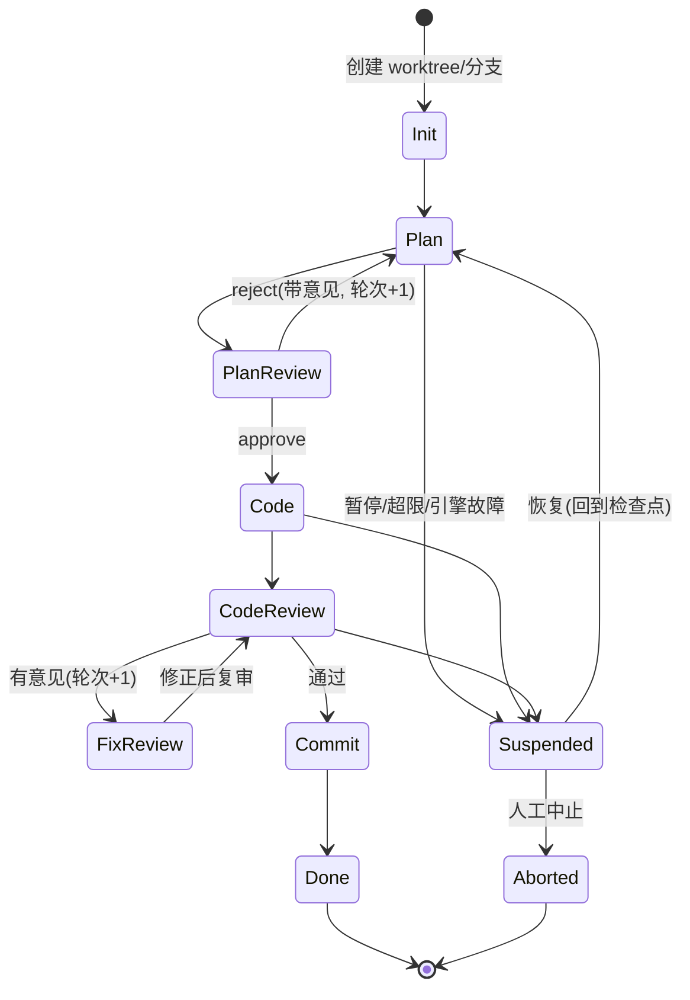

# 开发内核（codeloop）详细设计

> 上层文档：[architecture.md](./architecture.md)
> 内核是一个可独立使用的单任务自动化开发引擎：输入需求，自动完成 计划 → 计划评审 → 编码 → 代码检视 → 意见修正 → 提交 的闭环，人可随时观察与介入。

## 1. 运行模型

### 1.1 核心概念

| 概念 | 说明 |
|---|---|
| Task | 一次完整的开发任务：一段需求文本 + 一个仓库 + 一个 codeloop 配置。任务在独立 worktree/分支上运行 |
| Stage | 状态机的一个环节（Plan、Code、CodeReview…），一次目标明确的引擎调用或人工动作 |
| Iteration | 评审回环的轮次计数（计划回环和代码回环分别计数） |
| Checkpoint | Stage 边界的持久化快照，暂停/恢复/崩溃恢复的锚点 |
| Gate | 审批门：配置在某 Stage 之后，要求人（或 AI）给出 approve / reject 决定后才能继续 |
| Artifact | Stage 产物：计划文档、评审意见列表、diff、commit 等，全部落盘可追溯 |

### 1.2 codeloop 状态机



要点：

- **两个回环**：计划回环（PlanReview → Plan）与代码回环（CodeReview → FixReview → CodeReview），分别有独立的 `maxIterations`（默认计划 3 轮、代码 5 轮）；达到上限自动进入 `Suspended` 并发出 `intervention.required` 事件，等人处置，绝不无限循环。
- **Suspended 是一等状态**：暂停、预算超限、引擎崩溃、审批超时都收敛到这个状态，统一从最近 Checkpoint 恢复。
- 任何 Stage 失败先按策略自动重试（默认 1 次），仍失败才挂起。

### 1.3 各 Stage 职责与产物

| Stage | 执行者 | 输入 | 产物（Artifact） |
|---|---|---|---|
| Plan | 引擎（只读模式，禁写文件） | 需求文本 + 仓库上下文 | `plan.md`：目标、改动文件清单、步骤、验证方式 |
| PlanReview | AI 引擎 / 人 / 两者（按 Gate 配置） | plan.md | 评审结论 + 意见列表；reject 时意见回灌 Plan |
| Code | 引擎（可写 worktree） | plan.md（+ 历史评审意见） | 代码变更，按步骤形成 WIP commit |
| CodeReview | AI 引擎（建议与 Code 用不同引擎/模型）/ 人 | 分支 diff + plan.md | `review-N.json`：结构化意见列表（文件、行、severity、建议） |
| FixReview | 引擎（可写） | 未解决的意见列表 | 修正 commit + 逐条意见的处理标记（fixed / rejected+理由） |
| Commit | 内核自身（非引擎） | 全部 WIP commit | squash/整理为规范 commit（message 由引擎生成、人可改），跑配置的验证命令（lint/test） |

Commit Stage 中运行验证命令失败时，视为一条 blocker 级评审意见回到代码回环。

## 2. Stage 接口与可插拔性

```ts
// packages/kernel/src/loop/stage.ts
export interface StageContext {
  task: TaskSnapshot;                    // 任务快照(需求、配置、轮次)
  worktree: GitWorktree;                 // 当前工作区句柄
  artifacts: ArtifactStore;              // 读写产物
  engine: EngineSession;                 // 本 Stage 绑定的引擎会话
  emit(event: KernelEvent): void;        // 发事件
  requestIntervention(req: InterventionRequest): Promise<InterventionDecision>;
  signal: AbortSignal;                   // 暂停/中止信号
}

export interface Stage {
  readonly name: StageName;
  run(ctx: StageContext): Promise<StageResult>;
}

export type StageResult =
  | { kind: "next" }                                   // 进入默认下一环节
  | { kind: "loop"; reason: string; payload?: unknown } // 回环(评审不通过)
  | { kind: "suspend"; reason: SuspendReason };

export type StageName =
  | "init" | "plan" | "planReview" | "code"
  | "codeReview" | "fixReview" | "commit";
```

- 状态机引擎只认识 `Stage` 接口和 `StageResult`，Stage 的内部实现（调引擎、调人、跑命令）完全自由，因此评审环节换成"AI + 人双审"只是换一个 Stage 实现。
- 转移表由 codeloop 配置声明（见 2.1），第一版内置默认流程，不开放自定义 DAG（避免过度设计），但 Stage 实现可注册替换。

### 2.1 codeloop 配置（`.codeloop/config.yaml`）

```yaml
version: 1
engines:
  default:
    type: claude-code            # claude-code | cursor-cli | codex
    model: sonnet
  reviewer:
    type: codex                  # 评审用不同引擎, 避免自审偏差
loop:
  plan:
    engine: default
    maxIterations: 3
  planReview:
    mode: ai-then-human          # ai | human | ai-then-human
    gate: required               # required | auto(AI 通过即放行)
  code:
    engine: default
  codeReview:
    engine: reviewer
    maxIterations: 5
    severityGate: major          # 达到该级别的意见必须修复
  commit:
    verify: ["pnpm lint", "pnpm test"]
    messageStyle: conventional
budget:
  maxEngineCalls: 60
  stageTimeoutMinutes: 30
git:
  branchPrefix: codeloop/
  worktreeRoot: .codeloop/worktrees
```

## 3. 人工介入机制

人工介入有三种形式，全部通过统一的控制通道（CLI 交互 / HTTP API）到达内核：

### 3.1 审批门（Gate）

配置了 `gate: required` 的 Stage 结束后，内核发出 `intervention.required` 事件并阻塞（带可配超时，超时进 Suspended）。决定的结构：

```ts
export type InterventionDecision =
  | { action: "approve" }
  | { action: "reject"; comments: ReviewComment[] }   // 意见回灌上一 Stage
  | { action: "edit"; note: string };                 // 人已直接改了产物(计划文档/代码), 内核重新读取后继续
```

`edit` 是关键设计：人可以直接在 worktree 改代码或改 `plan.md`，然后告诉内核"我改过了，继续"。内核把人工改动作为一个独立 commit 固化（author 标记为人），保证审计链完整。

### 3.2 暂停 / 恢复 / 中止

- `pause`：向当前 Stage 的 `AbortSignal` 发信号。引擎子进程被终止，Stage 回滚到本 Stage 开始时的 Checkpoint（worktree 用 git 清理到检查点 commit），状态置 Suspended。
- `resume`：从 Checkpoint 重建 StageContext 重跑当前 Stage，可附带一段人工指令（见 3.3）。
- `abort`：终止任务，worktree 保留（人可能要捡走部分成果），分支不删除。

### 3.3 指令注入

任意时刻可以给任务追加一条人工指令（如"计划里第 3 步改用方案 B"、"不要动 legacy/ 目录"）。指令进入任务的 **指令队列**，在下一个 Stage 开始时拼进该 Stage 的 prompt，并作为事件记录在案。运行中的 Stage 不被打断（要立即生效就先 pause）。

### 3.4 崩溃恢复

Checkpoint 内容 = 状态机位置 + 轮次计数 + worktree 的 HEAD commit + 引擎会话 id + 未消费的指令队列，写入本地 SQLite。进程崩溃后 `codeloop resume <taskId>` 可从最近 Checkpoint 继续；引擎会话若可续接（各 CLI 均支持 resume/session id）则续接，否则以 Checkpoint 的产物冷启动该 Stage。

## 4. Engine Adapter

### 4.1 接口

```ts
// packages/kernel/src/engines/adapter.ts
export interface EngineAdapter {
  readonly type: EngineType;                 // "claude-code" | "cursor-cli" | "codex"
  probe(): Promise<EngineInfo>;              // 检查 CLI 是否安装/登录, 版本
  createSession(opts: SessionOptions): Promise<EngineSession>;
  resumeSession(sessionId: string, opts: SessionOptions): Promise<EngineSession>;
}

export interface SessionOptions {
  cwd: string;                 // 任务 worktree
  model?: string;
  readonly?: boolean;          // Plan/Review 等只读 Stage 禁写
  allowedTools?: string[];     // 映射到各 CLI 的权限参数
  env?: Record<string, string>;
}

export interface EngineSession {
  readonly sessionId: string;
  // 一次对话轮: 发 prompt, 流式回传结构化块, resolve 为最终文本
  send(prompt: string, onChunk?: (c: EngineChunk) => void): Promise<EngineTurnResult>;
  interrupt(): Promise<void>;              // 终止当前轮(pause 时用)
  dispose(): Promise<void>;
}

export type EngineChunk =
  | { kind: "text"; text: string }
  | { kind: "toolUse"; tool: string; summary: string }     // 如 "edit src/a.ts"
  | { kind: "fileChange"; path: string; op: "create" | "edit" | "delete" };

export interface EngineTurnResult {
  text: string;                            // 最终回复(计划文档/评审 JSON 等)
  usage?: { inputTokens: number; outputTokens: number; costUsd?: number };
  filesChanged: string[];
}
```

### 4.2 子进程管理与流式解析

各 CLI 统一以**非交互 headless 模式**驱动，stdout 输出结构化 JSON 流：

| 引擎 | 调用方式（示意） | 会话续接 |
|---|---|---|
| Claude Code | `claude -p <prompt> --output-format stream-json --permission-mode ...` | `--resume <session-id>` |
| Cursor CLI | `cursor-agent -p <prompt> --output-format stream-json` | `--resume <chat-id>` |
| Codex CLI | `codex exec <prompt> --json --sandbox workspace-write` | `codex exec resume <session-id>` |

> 各 CLI 参数随版本演进，Adapter 实现时以 `probe()` 探测到的版本对应的 `--help` 为准，参数表集中维护在各 Adapter 文件顶部。

统一的子进程封装负责：

- 按行解析 stream-json，映射为 `EngineChunk`（不认识的事件类型透传为原始日志，不报错）；
- 空闲超时（可配，默认 5 分钟无输出）与 Stage 总超时，超时先发 SIGINT、宽限后 SIGKILL；
- stderr 收集进任务日志；退出码非零映射为 `EngineError`，由 Stage 重试策略处置；
- token/费用统计从结果事件提取，累计到任务预算。

### 4.3 结构化产出约定

评审等需要结构化输出的 Stage，通过 prompt 约定引擎输出 JSON（写入指定文件而非 stdout，避免流式文本污染），内核用 zod schema 校验；校验失败自动追加一轮"格式修正" prompt（最多 2 次），仍失败按 Stage 失败处理。

```ts
export interface ReviewComment {
  id: string;
  file?: string;
  line?: number;
  severity: "blocker" | "major" | "minor" | "nit";
  comment: string;
  suggestion?: string;
  status: "open" | "fixed" | "rejected";   // FixReview 更新
  rejectReason?: string;
}
```

## 5. 持久化与目录布局

任务数据全部落在仓库旁的 `.codeloop/` 下（gitignore）：

```
.codeloop/
├── config.yaml
├── kernel.db                  # SQLite: tasks / checkpoints / interventions / usage
├── worktrees/<taskId>/        # 任务工作区
└── tasks/<taskId>/
    ├── events.jsonl           # append-only 全量事件流(审计源)
    ├── artifacts/
    │   ├── plan.md
    │   ├── plan-review-1.json
    │   ├── review-1.json
    │   └── ...
    └── engine-logs/           # 各引擎子进程原始输出
```

SQLite 存**可查询状态**（任务列表、检查点、审批记录、用量），JSONL 存**完整事件历史**；事件流是唯一事实源，SQLite 可由事件流重建。

## 6. 事件协议

事件是内核对外的核心接口，类型定义在 `packages/shared`，L2 与 CLI 共用。

```ts
export interface KernelEvent<T = unknown> {
  seq: number;                 // 任务内单调递增, 用于断线重放
  taskId: string;
  ts: string;                  // ISO 8601
  type: KernelEventType;
  payload: T;
}

export type KernelEventType =
  // 任务生命周期
  | "task.created" | "task.started" | "task.suspended"
  | "task.resumed" | "task.aborted" | "task.completed" | "task.failed"
  // Stage
  | "stage.started"            // { stage, iteration }
  | "stage.completed"          // { stage, result, artifactIds }
  | "stage.retrying"           // { stage, attempt, error }
  // 引擎过程(细粒度进度, UI 实时渲染用)
  | "engine.chunk"             // { stage, chunk: EngineChunk }
  | "engine.turn.completed"    // { stage, usage }
  // 产物与代码
  | "artifact.created"         // { artifactId, kind, path }
  | "git.commit"               // { sha, message, author: "engine" | "human" }
  // 评审与介入
  | "review.completed"         // { stage, comments: ReviewComment[], passed }
  | "intervention.required"    // { requestId, stage, kind: "gate" | "limit" | "error", summary }
  | "intervention.resolved"    // { requestId, decision }
  | "instruction.injected"     // { text, by }
  // 预算
  | "budget.warning" | "budget.exceeded";
```

约定：

- `engine.chunk` 量大，事件流订阅可带 `?verbose=false` 过滤，只留 Stage 级事件；JSONL 中始终全量。
- 消费方通过 `seq` 做幂等与断线重放：`GET /tasks/:id/events?after=<seq>`。

## 7. 控制 API（`codeloop serve`）

守护模式绑定本机端口（默认 `127.0.0.1:4700`，可配 token 鉴权供 L2 远程接入）：

```
POST   /tasks                          # { requirement, repoPath, configOverrides? } → { taskId }
GET    /tasks                          # 任务列表(状态摘要)
GET    /tasks/:id                      # 快照: 状态机位置/轮次/产物/git 状态/用量
POST   /tasks/:id/pause
POST   /tasks/:id/resume               # { instruction? }
POST   /tasks/:id/abort
POST   /tasks/:id/instructions         # { text }        指令注入
POST   /tasks/:id/interventions/:reqId # InterventionDecision   审批决定
GET    /tasks/:id/events?after=seq     # 历史事件(重放)
GET    /tasks/:id/artifacts/:artifactId
WS     /tasks/:id/stream?verbose=      # 实时事件流
WS     /stream                         # 全部任务的聚合事件流(L2 用)
```

CLI 本地使用时不起服务，直接进程内调用内核库；`serve` 模式下 CLI 命令自动转发到守护进程（通过 `.codeloop/kernel.lock` 发现）。

## 8. CLI 设计

```
codeloop run "<需求>"          # 创建并运行任务, 进入交互式进度界面
codeloop run -f req.md --config loop.yaml --no-gate
codeloop list                  # 任务列表
codeloop show <taskId>         # 任务详情(阶段/轮次/产物/用量)
codeloop watch <taskId>        # 附着到运行中任务, 实时渲染进度
codeloop pause|resume|abort <taskId>
codeloop approve <taskId> [--comment ...]   # 审批门决定
codeloop reject <taskId> -m "改用方案B"
codeloop inject <taskId> -m "不要动 legacy/"
codeloop diff <taskId>         # 当前分支 diff
codeloop serve [--port 4700 --token ...]    # 守护模式(供 L2 / 远程)
codeloop doctor                # 检查引擎 CLI 安装/登录状态
```

交互式界面（Ink 渲染）：上方为 Stage 进度条（`Plan ✓ → PlanReview ✓ → Code ● → …` 与轮次），中间滚动引擎动作摘要（`engine.chunk` 的 toolUse/fileChange），下方状态栏显示用量/预算；到达审批门时就地弹出 approve/reject/edit 选择。

---

管理系统如何编排多个内核实例 → [platform-design.md](./platform-design.md)
