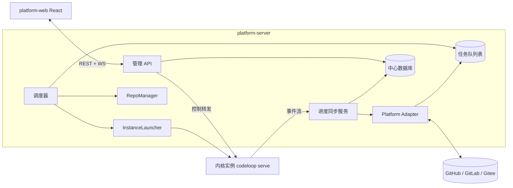
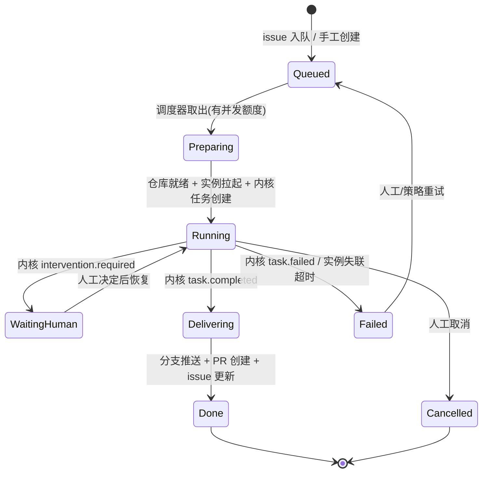
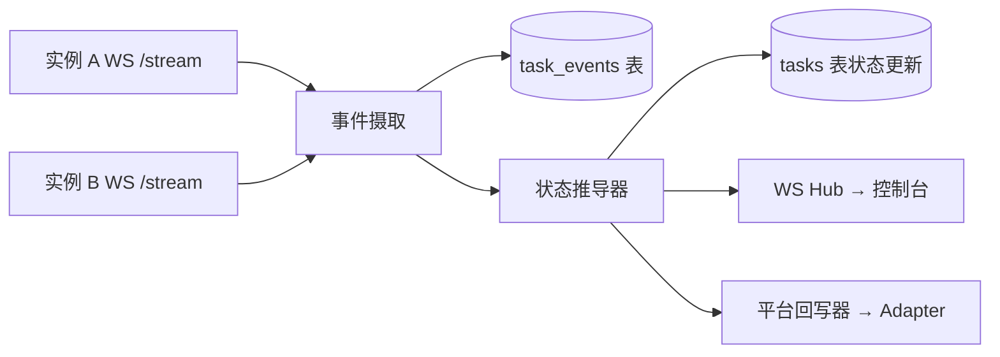

# 管理系统（platform）详细设计

> 上层文档：[architecture.md](./architecture.md)；内核接口契约见 [kernel-design.md](./kernel-design.md) 第 6、7 节。
> 管理系统编排多个开发内核实例：对接类 GitHub 平台拉取 issue，派发给内核自动开发，聚合进度回写平台，并提供 Web 控制台供团队观察与介入。

## 1. 模块划分



单进程 Node 服务内的逻辑模块（第一版不拆微服务）：

| 模块 | 职责 |
|---|---|
| Platform Adapter | 平台对接：发现 issue、认领、回写评论/状态、创建 PR |
| RepoManager | 仓库本地缓存：clone/fetch、为任务准备基线 commit、任务完成后推送分支。**不保存**内核配置；配置在 clone 的 `.codeloop/config.yaml` |
| 调度器 + 任务队列 | 任务入队、并发控制、派发、失败重试、僵尸实例回收 |
| InstanceLauncher | 拉起/终止内核实例（第一版本地子进程，接口预留容器化） |
| 进度同步服务 | 订阅所有实例事件流 → 落中心 DB → 推送 Web / 回写平台 |
| 管理 API | 控制台的 REST + WebSocket 入口；人工介入请求转发给对应实例 |

## 2. 任务生命周期与调度

### 2.1 任务状态机（L2 视角）



L2 状态由内核事件驱动推导（如收到 `intervention.required` 进 WaitingHuman），不重复维护内核内部的 pipeline 节点细节，只做粗粒度镜像；节点级进度（含任务的 pipeline 快照）直接透传给前端展示。

### 2.2 调度器

- **队列**：中心 DB 的 `tasks` 表即队列（`status = queued` 按优先级 + 入队时间取），不引入独立 MQ；调度器单实例轮询 + 事件唤醒。
- **并发控制**：全局最大实例数、按仓库最大并发（默认同仓库串行 = 1，避免分支冲突；同仓库并发时靠 worktree 隔离 + 不同分支）。
- **派发**：`Preparing` 阶段：RepoManager 确保 `clone_path` 最新 → 复用该仓已有内核，否则 `codeloop serve --repo <clone>` 拉起（一仓一进程）→ 调内核 `POST /tasks`，记录 `instanceId + kernelTaskId`。内核读该仓 `.codeloop/config.yaml`。
- **失败与重试**：内核 `task.failed` 按任务的重试策略（默认不自动重试，标记 Failed 等人处理；可配置自动重试 N 次）；实例心跳（事件流断连 + 探活失败超过阈值）视为僵尸，回收进程并将任务置 Failed。
- **崩溃恢复**：调度器重启后扫描 `Running` 任务，重连实例事件流（用 `seq` 补拉断档事件）；实例已死的，利用内核的 Checkpoint 机制拉起新实例 `resume`。

### 2.3 InstanceLauncher 接口

```ts
export interface InstanceLauncher {
  launch(spec: InstanceSpec): Promise<InstanceHandle>;   // spec: 仓库路径/端口/资源限制
  terminate(handle: InstanceHandle): Promise<void>;
  probe(handle: InstanceHandle): Promise<"alive" | "dead">;
}
// 第一版: LocalProcessLauncher(spawn `codeloop serve --port <随机>`)
// 扩展点: DockerLauncher / K8sLauncher(实例+Agent CLI 打包进镜像)
```

## 3. Platform Adapter

### 3.1 接口

```ts
export interface PlatformAdapter {
  readonly type: "github" | "gitlab" | "gitee";
  // 发现: webhook 优先, 轮询兜底
  pollCandidateIssues(repo: RepoRef): Promise<PlatformIssue[]>;
  handleWebhook(headers: Record<string, string>, body: unknown): Promise<PlatformEvent | null>;
  // 认领与进度
  claimIssue(issue: IssueRef): Promise<void>;            // 打 in-progress 标签 + 认领评论
  postProgress(issue: IssueRef, report: ProgressReport): Promise<void>;  // 更新进度评论
  // 交付
  createPullRequest(req: CreatePrRequest): Promise<PrRef>; // 关联 issue(Closes #N)
  updateStatus(issue: IssueRef, status: TaskStatus): Promise<void>;
  // 双向: PR 上的人工评论可转为内核指令(第一版只读取, 见 4.3)
  fetchPrComments(pr: PrRef, since?: string): Promise<PlatformComment[]>;
}
```

### 3.2 GitHub 首实现

- **认证**：GitHub App（细粒度仓库授权、独立机器人身份）优先，PAT 作为简易部署选项。
- **触发**：仓库配置监听规则——带 `ai-dev` 标签（可配）的 open issue 即候选；webhook（issues/issue_comment/pull_request 事件）为主，每 5 分钟轮询兜底。
- **认领**：入队成功后打 `ai-dev:in-progress` 标签并发认领评论（带控制台任务链接），防止重复派发；标签操作失败视为竞争丢失，放弃该 issue。
- **进度回写**：机器人在 issue 下维护**单条可编辑的进度评论**（避免刷屏），关键节点更新：任务开始（含分支名）、计划完成（附计划摘要 + 控制台链接）、进入编码、每轮评审结果、等待人工介入（@ 相关人）、PR 已创建。
- **交付**：任务 Delivering 时由 RepoManager 推送分支（凭证只在 L2，内核不接触，见 architecture.md 第 7 节），Adapter 创建 PR：标题取自 commit、正文含计划摘要 + 评审轮次统计 + `Closes #N`。
- **issue 需求转换**：issue 标题 + 正文 + 现有评论拼接为需求文本；带 `ai-dev:needs-info` 标签的除外（人标记信息不足）。

### 3.3 GitLab / Gitee 兼容性

接口中不出现 GitHub 专有概念：统一用 `IssueRef { repo, number }`、`PrRef`（GitLab 的 MR 同样映射）、标签字符串。差异点（如 GitLab approval 规则）留在各 Adapter 内部。

## 4. 进度同步服务

### 4.1 事件管道



- **摄取**：每实例一条 WebSocket 订阅（`verbose=false`，节点级事件；控制台打开任务详情时才由 API 直连该实例拉 verbose 流，细粒度 `engine.chunk` 不进中心 DB）。
- **幂等**：`task_events` 以 `(kernel_task_id, seq)` 唯一，断线重连用最后 seq 补拉。
- **回写节流**：平台评论更新合并节流（同任务 ≥ 30s 一次），`intervention.required` 例外立即回写并 @ 人。

### 4.2 人工介入通路

控制台上的审批/注入/暂停操作 → 管理 API 校验权限 → 查 `instanceId` → 转发到该实例的内核控制 API → 决定与结果以事件回流。管理 API 不落介入业务逻辑，只做鉴权、审计（`interventions` 表）与转发。

### 4.3 平台侧介入（第一版最小实现）

issue/PR 评论中 @ 机器人并以 `/codeloop` 开头的命令映射为内核操作：`/codeloop approve`、`/codeloop reject <意见>`、`/codeloop inject <指令>`、`/codeloop abort`。仅限仓库 write 权限成员，其余评论忽略。

## 5. 数据与配置

### 5.1 归属原则

**1 个 platform-server : N 个接入仓库。** Server 启动时不绑定任何 git 仓库；仓库经控制台 `POST /api/repos` 登记。调度时每个仓库最多一个内核进程（`codeloop serve --repo <clone_path>`），可复用。

两套配置、两处状态，不收入同一张表：

| 跟谁走 | 落点 | 内容 |
|---|---|---|
| 跟平台 | `platform.config.yaml`（启动解析一份：`--config` → `CODELOOP_PLATFORM_HOME` → 向上找 → `~/.codeloop-platform/`） | 监听、`dataDir` / `reposCache`、调度并发、GitHub/平台 token、`codeloopBin`、默认分支 |
| 跟平台 | `{dataDir}/platform.db` | 接入清单、任务队列、内核实例、聚合事件、介入审计 |
| 跟仓库 | `{clone_path}/.codeloop/config.yaml` | pipeline、引擎 / 模型 / prompt、预算、git 前缀、gate / sandbox |
| 跟仓库 | `{clone_path}/.codeloop/` | `kernel.db`、`events.jsonl`、worktree、任务产物与 pipeline 快照 |

```
{platform home}/
  ├── platform.config.yaml          # 跟 server
  ├── {dataDir}/platform.db         # 跟 server
  └── {reposCache}/
        └── owner__name/            # 该仓的 clone
              └── .codeloop/
                    ├── config.yaml # 跟仓库
                    ├── kernel.db
                    ├── events.jsonl
                    ├── tasks/<id>/
                    └── worktrees/
```

- `repos` 行是**接入记录**（`full_name`、`clone_path`、触发标签、并发、token、默认分支），不是内核配置副本。
- 控制台 `GET/PUT /api/repos/:id/config` 读写 `clone_path` 上的 yaml；内核 `loadConfig(clone_path)` 读同一份。
- `.codeloop/` 默认 gitignore：配置在本机 clone，不随远程仓库走；重 clone 会丢，除非另做同步。
- 平台创建任务时可覆盖个别运行时字段（如 `autoApproveGates: false` 以便控制台审批），不改写仓库 yaml。

内核配置的字段与占位符见 [kernel-design.md §2.5](./kernel-design.md#25-codeloop-配置codeloopconfigyaml)。

### 5.2 中心数据库表结构

第一版 SQLite（`node:sqlite`，`{dataDir}/platform.db`）：

```sql
-- 接入记录与派发规则（不含内核配置）
CREATE TABLE repos (
  id              TEXT PRIMARY KEY,
  platform        TEXT NOT NULL,              -- github | gitlab | gitee
  full_name       TEXT NOT NULL,              -- owner/name
  clone_path      TEXT NOT NULL,              -- 本地 clone
  trigger_label   TEXT NOT NULL DEFAULT 'ai-dev',
  max_concurrency INTEGER NOT NULL DEFAULT 1,
  github_token    TEXT,                       -- 可选；缺省用平台级 token
  default_branch  TEXT NOT NULL DEFAULT 'main',
  created_at      TEXT NOT NULL,
  updated_at      TEXT NOT NULL,
  UNIQUE(platform, full_name)
);

-- L2 任务(队列即此表)
CREATE TABLE tasks (
  id                  TEXT PRIMARY KEY,
  repo_id             TEXT NOT NULL REFERENCES repos(id),
  source              TEXT NOT NULL,            -- issue | manual | ci-fix
  issue_number        INTEGER,
  title               TEXT NOT NULL,
  requirement         TEXT NOT NULL,
  status              TEXT NOT NULL,            -- queued|preparing|running|paused|waiting_human|delivering|done|merged|failed|cancelled
  priority            INTEGER NOT NULL DEFAULT 0,
  instance_id         TEXT,
  kernel_task_id      TEXT,                     -- 该 clone 内核侧 taskId
  branch              TEXT,
  pr_number           INTEGER,
  current_node        TEXT,
  loop_state          TEXT,
  pipeline_name       TEXT,
  progress_comment_id TEXT,
  error               TEXT,
  retry_count         INTEGER NOT NULL DEFAULT 0,
  next_retry_at       TEXT,
  parent_task_id      TEXT,                     -- 派生任务(如 ci-fix)
  created_at          TEXT NOT NULL,
  updated_at          TEXT NOT NULL
);
CREATE INDEX idx_tasks_queue ON tasks(status, priority DESC, created_at);

-- 已拉起的内核进程（一仓最多复用一个）
CREATE TABLE instances (
  id           TEXT PRIMARY KEY,
  launcher     TEXT NOT NULL,                -- local-process | docker | ...
  repo_id      TEXT REFERENCES repos(id),
  endpoint     TEXT NOT NULL,                -- http://127.0.0.1:port
  token        TEXT,                         -- 该实例的内核 API token
  pid          INTEGER,
  status       TEXT NOT NULL,                -- starting|idle|busy|dead
  started_at   TEXT NOT NULL,
  last_seen_at TEXT NOT NULL
);

CREATE TABLE task_events (
  task_id  TEXT NOT NULL REFERENCES tasks(id),
  seq      INTEGER NOT NULL,
  ts       TEXT NOT NULL,
  type     TEXT NOT NULL,
  payload  TEXT NOT NULL,
  PRIMARY KEY (task_id, seq)
);

CREATE TABLE interventions (
  id          TEXT PRIMARY KEY,
  task_id     TEXT NOT NULL REFERENCES tasks(id),
  request_id  TEXT NOT NULL,
  kind        TEXT NOT NULL,                -- gate | limit | error | manual
  decision    TEXT,
  decided_by  TEXT,
  channel     TEXT NOT NULL,                -- web | cli | platform-comment
  created_at  TEXT NOT NULL,
  decided_at  TEXT
);

CREATE TABLE usage_records (
  task_id       TEXT NOT NULL REFERENCES tasks(id),
  stage         TEXT NOT NULL,
  engine_type   TEXT NOT NULL,
  input_tokens  INTEGER NOT NULL,
  output_tokens INTEGER NOT NULL,
  cost_usd      REAL,
  ts            TEXT NOT NULL
);
```

## 6. 管理 API（控制台契约）

```
# 仓库接入（DB 接入记录）
GET/POST/PATCH /api/repos

# 仓库内核配置（读写 clone 上的 .codeloop/config.yaml，不进 DB）
GET/PUT /api/repos/:id/config
GET     /api/config/meta                   # 内置 pipeline / 可用引擎

# 任务
GET    /api/tasks?status=&repo=            # 列表(看板)
POST   /api/tasks                          # 手工创建(不经 issue)
GET    /api/tasks/:id                      # 详情: L2 状态 + 内核快照
GET    /api/tasks/:id/detail
GET    /api/tasks/:id/events?after=        # 历史事件(实例不在则读 clone 磁盘)
GET    /api/tasks/:id/artifacts/:artifactId # 产物(优先代理内核，否则读 clone)
DELETE /api/tasks/:id
POST   /api/tasks/:id/retry|cancel

# 人工介入(转发内核, 见 4.2)
POST   /api/tasks/:id/pause|resume|abort
POST   /api/tasks/:id/instructions
POST   /api/tasks/:id/interventions/:reqId

# 实时
# 实例
GET    /api/instances
POST   /api/instances/:id/terminate

# 实时
WS     /api/stream                         # 全局: 任务状态变化 + 介入请求(看板/通知用)
WS     /api/tasks/:id/stream               # 单任务 verbose 流(代理该实例, 详情页用)

# Webhook
POST   /webhooks/github
```

## 7. Web 控制台（platform-web）

React + Vite，页面结构：

- **任务看板**（首页）：按状态分列（排队/运行中/等人/已完成/失败），卡片显示仓库、issue 链接、当前节点进度条（按任务的 pipeline 快照渲染）、循环轮次；`waiting_human` 列置顶高亮 + 浏览器通知。
- **任务详情**：
  - 头部：L2 状态、分支、issue/PR 链接、用量与预算条、pause/resume/abort 操作；
  - 节点时间线：按 pipeline 快照渲染，每个节点的起止、循环轮次、产物入口；
  - 实时活动流：verbose 事件渲染（引擎正在做什么、改了哪些文件）；
  - 产物查看：计划文档（markdown 渲染）、评审意见列表（按 severity 分组、逐条状态）、diff 查看器；
  - 介入面板：审批门出现时就地 approve/reject（带意见输入）/edit 确认，任意时刻可注入指令。
- **仓库管理**：接入仓库、配置触发标签/并发；内核配置（pipeline / 引擎）编辑 clone 上的 `.codeloop/config.yaml`；GitHub App 安装引导。
- **实例监控**：实例列表（状态/承载任务/心跳），手动回收。

鉴权第一版做简单方案：控制台账号 + session（内网部署），OIDC/SSO 留作扩展；操作人身份贯穿到 `interventions.decided_by` 审计字段。

## 8. 第一版边界（明确不做）

- 不做独立 MQ、微服务拆分、多调度器高可用（单点调度器 + 崩溃恢复足够）；
- 不做容器化 Launcher（接口已预留）；
- 平台侧只实现 GitHub；
- PR 上的 review comment 自动转开发意见只做 `/codeloop` 命令式，不做自然语言理解全量同步；
- 不做多租户与配额计费，预算控制沿用内核任务级配置。
